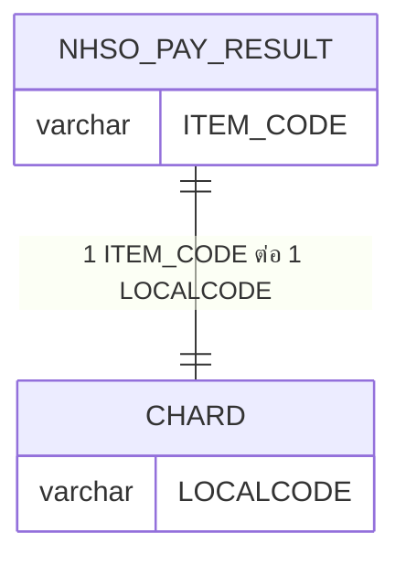
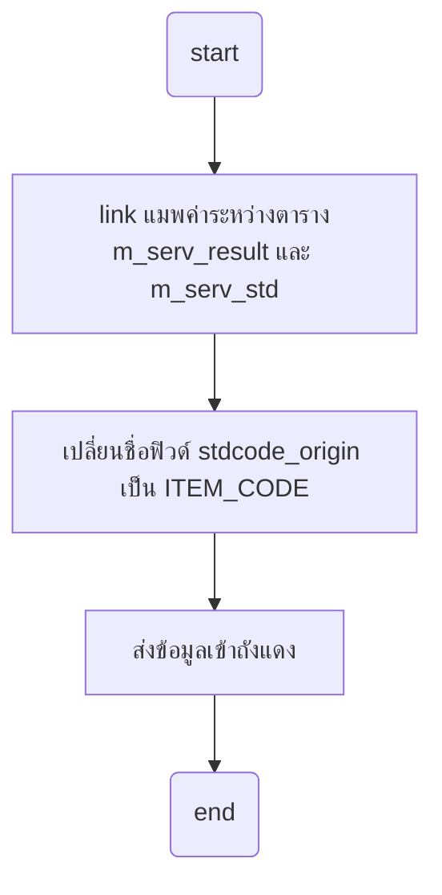
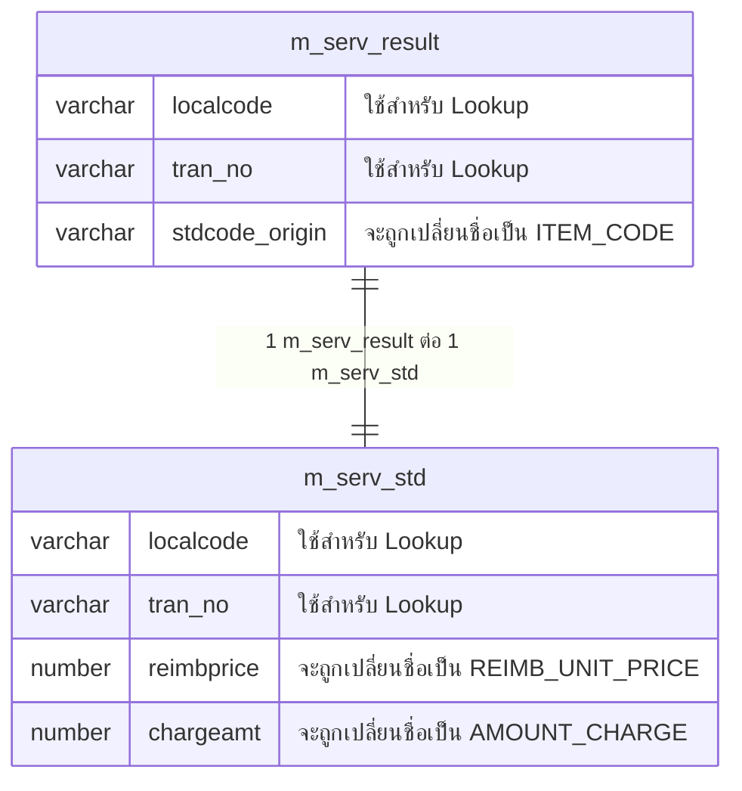

# การหา ITEM_CODE จากฐาน Super App

ค่าเดียวกันจะถูกใช้ใน 2 ฟิวด์ที่มีค่าเดียวกัน คือ
- ฟิวด์ `ITEM_CODE` จะถูกใช้ในแฟ้ม `NHSO_PAY_RESULT`
- ฟิวด์ `LOCALCODE` จะถูกใช้ในแฟ้ม `CHARD`

## สร้าง ITEM_CODE ในแฟ้ม NHSO_PAY_RESULT

**คอนเซปจะต้องทำการ link 2 ตารางนี้เข้าด้วยกันด้วยค่า `localcode` แต่ตอนส่งจะส่งด้วยค่า `stdcode_origin`**

- `m_serv_result` ฟิวด์ส่วนใหญ่จะถูกแปลงค่าเป็น `NHSO_PAY_RESULT`
- `m_serv_std` ฟิวด์ส่วนใหญ่จะถูกแปลงค่าเป็น `CHARD`

